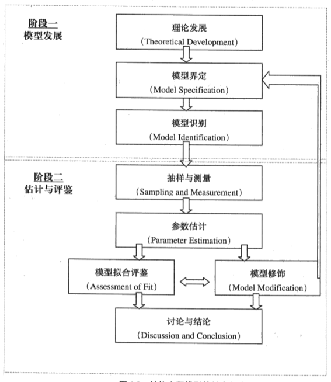
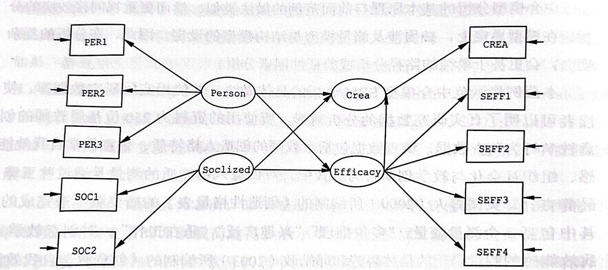

```{r setup, include=FALSE}
knitr::opts_chunk$set(echo = TRUE)
```
   
   
## 调节效应和中介效应

### 调节效应

#### 调节效应的基础

**调节效应**（Moderation Effect）是统计学和社会科学中的一个概念，指的是某个第三变量（称为**调节变量**或**调节因子**）能够改变两个其他变量之间的关系的强度或方向所产生的作用。通过调节效应的分析，可以更好地理解复杂的变量关系，为研究者提供更加精细化的理论指导和建议。

当一个调节变量存在时，它会通过**影响自变量与因变量之间的关系**来发挥作用。例如：

- 如果 \( X \) 是自变量，\( Y \) 是因变量，\( Z \) 是调节变量，那么调节效应的核心是：
  \[
  Y = \beta_0 + \beta_1 X + \beta_2 Z + \beta_3 (X \cdot Z) + \epsilon
  \]
  其中，\( \beta_3 \) 是交互项系数，表示 \( Z \) 调节 \( X \) 和 \( Y \) 关系的强弱或方向。

#### 调节效应的示例  
  
1. 政府透明度与公众信任
- **自变量（X）**：政府透明度（Transparency）。
- **因变量（Y）**：公众对政府的信任（Public Trust）。
- **调节变量（Z）**：公民政治参与水平（Political Participation）。
  - **解释**：高水平的政治参与可能会增强透明度对公众信任的正面影响，因为公民更关注并感受到透明度带来的好处。
  - **效果**：
    - **高参与**：透明度增加显著提高公众信任。
    - **低参与**：透明度的影响不明显。
    
2. 财政分权与地方经济增长
- **自变量（X）**：财政分权程度（Fiscal Decentralization）。
- **因变量（Y）**：地方经济增长（Local Economic Growth）。
- **调节变量（Z）**：地方政府问责制（Government Accountability）。
  - **解释**：高问责制的地方，财政分权带来的灵活性能更有效地促进经济增长；而低问责制可能导致腐败和低效。
  - **效果**：
    - **高问责制**：财政分权显著促进经济增长。
    - **低问责制**：财政分权可能削弱经济增长。    
  
3. 环境政策严格性与污染治理成效
- **自变量（X）**：环境政策严格性（Environmental Policy Stringency）。
- **因变量（Y）**：污染治理效果（Pollution Mitigation Effectiveness）。
- **调节变量（Z）**：企业技术创新能力（Technological Innovation in Firms）。
  - **解释**：具有高技术创新能力的企业能够更好地适应和满足严格的环境政策要求。
  - **效果**：
    - **高创新能力**：政策严格性对治理成效有更大影响。
    - **低创新能力**：政策严格性可能导致高成本而无法显著改善污染。

#### 可视化调节效应

调节效应通常用**交互图**（Interaction Plot）展示。  

  - 将\( X \) 和 \( Y \) 的关系在不同 \( Z \) 水平下的表现。  
  - 不同 \( Z \) 水平会呈现不同的斜率或曲线。  

#### 调节效应分析示例

一项关于气候变化与灾害[Chapman and Lickel 2015](./chapman2015.pdf)的研究中，研究者向211名实验参与者讲述非洲发生干旱造成人道主义危机，告诉其中一半的参与者气候变化是造成干旱的原因，另一半参与者未被告知任何关于干旱的原因。接着通过一系列问题让实验参与者评价拒绝援助的正当性，以及了解他们对气候变化的怀疑程度。最后了解参与者捐款的意愿。
实验的目的是了解框架（frame），即是否告知干旱是由于气候变化产生的，对捐助意愿(donate)的影响[数据](./disaster.csv)。

假定对气候变化怀疑（skeptic）程度较高的人框架对捐助意愿的效应也比较小，会存在调节效应。

```{r moderation}
disaster <- read.csv("disaster.csv", header = T)
# 调节效应
moderafit <- lm(donate ~ frame + skeptic + frame:skeptic, data = disaster)
summary(moderafit)
```

### 中介效应

**中介效应**（Mediation Effect）是统计学和社会科学中的一个概念，指一个**中介变量**（Mediating Variable）在自变量（Independent Variable, \(X\)）和因变量（Dependent Variable, \(Y\)）之间起中介作用，即部分或全部传递自变量对因变量的影响。中介效应主要用于探讨变量之间的作用机制，揭示**因果路径**。中介效应的分析能够揭示隐藏的机制和作用路径，为理论研究提供深入的解释，并为实践应用提供精细化的决策依据。

#### 中介效应的基础
如果 \(X\) 通过一个中介变量 \(M\) 影响 \(Y\)，这表明 \(M\) 是 \(X\) 和 \(Y\) 之间的中介变量。公式化表达为：
\[
X \rightarrow M \rightarrow Y
\]
其中：  

- \(X\)：自变量，独立变量。
- \(Y\)：因变量，依赖变量。
- \(M\)：中介变量。

中介效应说明 \(X\) 不仅直接影响 \(Y\)（直接效应），还通过 \(M\) 间接影响 \(Y\)（间接效应）。


#### 中介效应的数学模型
经典的中介效应模型可以分为三步：  

1. **总效应模型**：\(Y = cX + \epsilon_1\)，其中 \(c\) 是 \(X\) 对 \(Y\) 的总效应。
2. **中介变量模型**：\(M = aX + \epsilon_2\)，其中 \(a\) 是 \(X\) 对 \(M\) 的效应。
3. **结果变量模型**：\(Y = c'X + bM + \epsilon_3\)，
   - \(c'\)：控制 \(M\) 后，\(X\) 对 \(Y\) 的直接效应。
   - \(b\)：\(M\) 对 \(Y\) 的效应。

间接效应由 \(a \times b\) 表示，总效应可以分解为：
\[
c = c' + (a \times b)
\]

#### 中介效应模型的效应类型
- **总效应**：自变量对因变量的总影响，包括直接效应和间接效应。
- **直接效应**：自变量对因变量的直接影响，不通过中介变量传递。
- **间接效应**：自变量通过中介变量对因变量的影响。

#### 中介效应的类型
1. **完全中介效应**（Full Mediation）
   - \(X\) 对 \(Y\) 的影响完全通过 \(M\) 传递。
   - 控制 \(M\) 后，\(X\) 对 \(Y\) 的直接效应 \(c'\) 不显著。

2. **部分中介效应**（Partial Mediation）
   - \(X\) 对 \(Y\) 的影响部分通过 \(M\) 传递。
   - 控制 \(M\) 后，\(X\) 对 \(Y\) 的直接效应 \(c'\) 仍然显著。

#### 中介效应的示例
1. 教育政策研究
- **自变量**：教育投资（Education Investment）。
- **中介变量**：师资水平（Teacher Quality）。
- **因变量**：学生成绩（Student Performance）。
  - **解释**：教育投资可以通过提升师资水平来间接影响学生成绩。

2. 公共卫生领域
- **自变量**：健康教育活动（Health Education）。
- **中介变量**：健康知识水平（Health Knowledge）。
- **因变量**：健康行为（Health Behavior）。
  - **解释**：健康教育活动通过提高健康知识水平，进而改变人们的健康行为。

3. 公共服务数字化与市民满意度
- **自变量（X）**：公共服务数字化水平（Digitalization of Public Services）。
- **中介变量（M）**：服务便利性（Convenience of Service）。
- **因变量（Y）**：市民满意度（Citizen Satisfaction）。
  - **解释**：数字化的服务提高了服务的便利性，间接提升市民对公共服务的满意度。

#### 中介效应的检验方法
- **逐步回归分析**：按照三步模型依次验证每个路径的显著性。
- **Bootstrap方法**：通过重复抽样计算间接效应及其置信区间，常用于提高检验效力。
- **Sobel检验**：检验间接效应是否显著，计算公式为：
  \[
  z = \frac{a \cdot b}{\sqrt{b^2 \cdot \text{SE}_a^2 + a^2 \cdot \text{SE}_b^2}}
  \]
  其中 \(\text{SE}\) 表示估计系数的标准误。

#### 中介效应与调节效应的区别
- **中介效应**：关注变量之间的**因果路径**，解释“**为什么**”自变量会影响因变量。
- **调节效应**：关注变量之间的**关系强弱**，解释“**在什么情况下**”自变量会影响因变量。

#### 中介效应分析的示例

上面气候变化与灾害的研究中，框架可能是通过影响正当性，然后正当性再影响捐助意愿的，即中介效应。

```{r mediation}
library(lavaan)
# 中介效应
mediamodel <- ' # 直接效应
donate ~ c*frame
# 中介效应
justify ~ a*frame
donate ~ b*justify
# 间接效应 (a*b)
ab := a*b
# 总效应
total := c + (a*b)
'
mediafit <- sem(mediamodel, data = disaster)
summary(mediafit)
```

绘制图形
```{r mediationplot}
library("semPlot")
semPaths(mediafit,whatLabels = 'est',residuals = F, nCharNodes=0, sizeMan = 12,edge.label.cex = 1.5)
```

### 条件过程模型

**条件过程模型**（Conditional Process Model）是一个综合框架，用于同时分析**中介效应**（Mediation Effect）和**调节效应**（Moderation Effect）。它探讨自变量通过中介变量影响因变量的机制，同时考虑调节变量如何影响这一机制的强度或方向。条件过程模型是一种强大的分析工具，能够揭示复杂的变量关系，为研究者提供深入的理论解释和实践指导。

#### 条件过程模型的基础
条件过程模型结合了中介效应和调节效应，回答以下关键问题：  

- **机制问题**：自变量如何通过中介变量间接影响因变量？（中介效应） 
- **情境问题**：这种中介效应在什么情况下更强或更弱？（调节效应） 

公式化表示为：
\[
Y = b_1 M + b_2 X + b_3 W + b_4 (M \cdot W) + \epsilon
\]
其中： 

- \(X\)：自变量。 
- \(M\)：中介变量。 
- \(Y\)：因变量。 
- \(W\)：调节变量。 
- \(b_4\)：调节变量 \(W\) 对中介效应的调节作用。 

#### 条件过程模型的关键特征
- **中介效应的调节**：调节变量 \(W\) 改变了自变量 \(X\) 通过中介变量 \(M\) 对因变量 \(Y\) 的间接影响。
- **模型交互**：条件过程模型包含交互项（例如 \(M \cdot W\)），用来描述调节效应如何影响中介效应。
- **多路径分析**：条件过程模型可以同时研究直接效应、间接效应和调节效应。

#### 条件过程模型的类型和示例
1. 调节的中介效应（Moderated Mediation Effect）
- **定义**：调节变量影响中介效应中某一路径的强度或方向。
- 解释：调节变量 (\(W\)) 改变了自变量 (\(X\)) 通过中介变量 (\(M\)) 对因变量 (\(Y\)) 的间接效应。
- \(X\)：自变量
- \(M\)：中介变量
- \(W\)：调节变量，对 \(X \to M\) 或 \(M \to Y\) 的路径进行调节
- \(Y\)：因变量

**示例**：环保政策严格性 (\(X\)) 通过企业创新 (\(M\)) 改善环境质量 (\(Y\))，但监管强度 (\(W\)) 调节这一过程。

2. 中介的调节效应（Mediated Moderation Effect）
- **定义**：中介变量的某一路径影响受调节变量的影响。 
- **解释**：中介变量 (\(M\)) 解释了调节变量 (\(W\)) 如何影响自变量 (\(X\)) 对因变量 (\(Y\)) 的关系。
- \(X \times W\)：自变量和调节变量的交互作用
- \(M\)：中介变量，解释交互作用如何影响 \(Y\)
- \(Y\)：因变量

**示例**：政策执行力度 (\(X\)) 和地方经济发展水平 (\(W\)) 的交互作用通过基层治理能力 (\(M\)) 间接影响社会稳定 (\(Y\))。

3. 结合复杂模型（Combined Model）  

**解释**：同时存在调节的中介效应和中介的调节效应，展示了变量之间更复杂的关系。 
- \(X → M → Y\)：中介效应
- \(W\)：调节变量同时作用于 \(X → M\) 和 \(M → Y\) 的路径。

**示例**：公共政策透明度 (\(X\)) 通过公众信任 (\(M\)) 增强公众满意度 (\(Y\))，但这种过程因社会参与度 (\(W\)) 的不同而改变。

#### 条件过程模型的分析方法  
 1. 基于回归分析的交互项建模  
  - 在回归模型中添加中介变量、调节变量以及交互项（如 \(M \cdot W\)）。  
  - 分析每个路径系数的显著性以验证条件过程关系。  

 2. Bootstrap法  
  - 通过Bootstrap重复抽样方法计算间接效应的置信区间。  
  - 验证不同调节水平下的中介效应是否显著。  

 3. PROCESS工具  
  - PROCESS工具是Andrew F. Hayes开发的一个专用宏，用于SPSS和R语言，可以直接分析复杂的条件过程模型。  

 4. 结构方程的路径分析  
  - 结合各类的结构方程分析软件进行路径分析。  

#### 条件过程模型的优点
 - **综合性强**：能够同时分析机制问题（中介效应）和情境问题（调节效应）。
 - **解释力强**：揭示复杂的因果路径和不同情境下的效果差异。
 - **广泛适用**：适用于社会科学、心理学、公共管理等多个领域。

### 条件过程模型的分析

综合调节与中介效应，框架对捐助意愿的直接和间接效应是受到怀疑程度的调节的，即被调节的中介效应。

```{r condproc}
# 具有调节中介效应的条件过程模型
cpmodel <- ' # 直接效应
donate ~ c1*frame + c2*skeptic + c3*skeptic:frame 
# 中介效应
justify ~ a1*frame + a2*skeptic + a3*skeptic:frame
donate ~ b*justify

# 间接效应取决于skeptic的值，需要用平均值（或其他代表值）带入计算间接效应
# 间接效应 (a*b) skeptic取平均值3.38
a1b := (a1+a3*3.38)*b
# 总效应
total := c1 + (a1+a3*3.38)*b
'
cpfit <- sem(cpmodel, data = disaster)
summary(cpfit)
```


图形
```{r condprocplot}
semPaths(cpfit,whatLabels = 'est', layout = "spring",,residuals = F, nCharNodes=0, sizeMan = 8,edge.label.cex = 1)
```

## 结构方程的特点

* 结构方程分析需要建立在理论基础上，从变量的测量、变量关系的假定和模型的设定都需要有清晰的理论支持或逻辑推理作为依据。
* 结构方程模型同时处理潜变量的测量和变量间关系的分析，变量测量中的误差也被包含在变量关系的分析过程中。
* 结构方程是基于变量间的协方差进行分析，协方差能够反映变量间的关联，也能反映理论模型生成的协方差与实际观测所得的协方差之间的差异。
* 结构方程需要大样本，样本量大于200。
* 结构方程的评估基于多重指标对整体模型进行比较，不依赖于单一的统计显著性。

## 结构方程模型分析的过程

```{r, echo=FALSE}

```

## 结构方程的组成

### 结构方程的变量：
  
  - 结构方程主要变量为尺度变量，类别变量只作为分组讨论的调节变量。
  - 潜变量(F)必须有两个以上（一般为3个以上，2个的情况需要模型存在多个潜变量，且之间存在关联性）的测量变量(V1, V2)，测量变量间的协方差反映潜在变量的共同影响，测量变量无法被潜变量解释的部分为测量误差(E1, E2)。
  - 内生潜变量所影响（对应）的为内生测量变量，外生潜变量所影响（对应）的为外生测量变量，内生潜变量的残差称为干扰项。

```{r, echo=FALSE}
knitr::include_graphics(c("variables.png","internal.png","param.png"))
```

### 结构方程的参数：
  - 测量模型参数包括潜变量与测量变量的关联强度$\lambda$，也成为因子载荷，外生测量变量的测量误差$\delta$，内生测量变量的测量误差$\varepsilon$，外生变量的协方差$\phi$。
  - 结构模型参数包括外生潜变量与内生潜变量之间的关系$\gamma$，内生潜变量之间的关系$\beta$，内生潜变量的残差或干扰项$\zeta$。

### 结构方程模型设定
  - 简效原则：将变量间的关系以最符合理论又最简单扼要的方式加以设定。如果一个简单模型能够解释较多实际数据的变化，那么以这个模型来说明数据的关系，比较不会得到错误的结论，结构方程可以防止弃真错误，难以防止纳伪错误。
  - 结构方程会遇到等值模型问题，即不同设定的模型拟合优度相等，可以通过前导理论策略（通过理论排除对等的模型）或参数竞争比较策略（比较对等模型参数估计）来解决。

## 结构方程模型识别
  - 结构方程的不同设定会产生模型识别问题，只有在过度识别条件下，才能对模型参数进行计算估计。通过比较待估参数数量$t$和测量数据量$DP$之间的大小，可以判断（必要不充分）模型能否参数估计。
    - 当$t < DP$，为过度识别，如同有三个方程，求两个未知数的解。
    - 当$t = DP$，为充分识别，如同有两个个方程，求两个未知数的解。
    - 当$t > DP$，为识别不足，如同只有一个方程，求两个未知数的解。
    - 其中，待估参数数量$t$根据具体的模型设定决定，测量数据量$DP$由外生测量变量的个数$p$和内生测量变量的个数$q$计算。
    $$DP=\frac{(p+q)(p+q+1)}{2}$$
  - 当结构方程模型设定没有结构关系的假设，模型可以顺利识别（Null Beta Rule）；当结构方程模型设定只估计结构参数，干扰项只估计方差不估计相关，模型自动识别（递归法则）。尽量保持简单的模型结构。

## 结构方程模型拟合评估
  - 结构方程模型分析策略与一般统计推断有明显差异，是以支持原假设作为模型拟合度存在的证据。
  - 结构方程的原假设是偏好的模型（根据理论对结构系数做出了某些假定，某些系数不为零）与实际观察的数据是相符的，其检验则是通过与饱和模型（对各观察变量之间关系都做了相关假定，所有系数均不为零）相比较，如果模型之间卡方检验值比较大，则说明两个模型存在显著差异，拒绝原假设（拒绝偏好的模型），接受饱和模型。
  - 模型的卡方统计量、自由度和p值，卡方值越小越好，p值大于0.05。但是样本量越大，p值会减少倾向显著，作为拟合优度指标并不准确，需要考虑其他拟合指数。如果模型正确，卡方统计量会等于其自由度，但增加估计参数的数量会减小卡方值。
  - 近似均方根残差Root Mean Square Error of Approximation (RMSEA; Steiger, 1990) 和90%的置信区间，越小越好，小于0.08比较理想。
  - 比较拟合指数Comparative Fit Index (CFI; Bentler, 1990)，越大越好，应大于0.9。
  - 标准化均方根残差Standardized Root Mean Square Residual (SRMR)，越小越好，大于0.1说明拟合不好。  

```{r, echo=FALSE}
knitr::include_graphics(c("fitindex.png"))
```

## 验证性因子分析
### 验证性因子分析的原理
  - 不同于探索性因子分析（EFA），验证性因子分析（CFA）必须有特定的理论或概念架构作为基础。CFA可以作为结构方程模型的前置步骤，也可以独立进行，只检验测量模型。
  - CFA要求构念要有明确的操作化定义界定内容与范畴；测量构念的指标要能被明确指出，并且同一构念指标要具有相当的一致性，不同构念指标要具有区分度；还要经过统计验证观察数据能否支持或推翻构念是否存在的假设。
  - CFA模型中，从潜变量到测量变量的箭头，代表研究者所假设的潜变量到测量变量的因果关系，统计估计量称为因子载荷，类似于回归系数，测量变量的变异可以拆解为共同变异（common variance）和独特变异（unique variance）。
  - 与回归模型将测量误差作为随机误差处理不同，CFA将测量变量中分离独特变异，这种变异包括了随机误差和系统误差（例如方法效益带来的误差，会导致题项相关系数偏大）。CFA可以通过共变关系分析和多维测量假设有效估计独特变异中的系统性误差。
  
```{r, echo=FALSE}
knitr::include_graphics(c("cfa1.png", "cfa2.png", "cfa3.png", "cfa4.png"))
```

### CFA的内部拟合检验{#internaltest}
  - CFA除了要求整体拟合效果外，还要求针对个别因子的质量进行检验，了解个别参数是否理想（项目信效度），各潜变量的组合情形是否稳定可靠（构念的信效度）。遇到不理想的参数，可以剔除不良题项或添加参数提高测量模型的内在拟合。
  - 项目质量检验：题项测量误差越小则信度越高，而因子载荷越高则测量误差越小，所以可以用因子载荷来判断题项质量。一般当因子载荷$\lambda$大于0.71时，$\lambda^2$为50%，意味着潜变量能够解释测量变量50%的变异（即回归的R方），说明项目具有理想质量。但是对于社会科学而言，编制的量表因子载荷都不会太高，因子载荷$\lambda$大于0.55（$\lambda^2$为30%）即是理想的结果。
  - 组合信度（$\rho_c$）：对于一组题项而言，潜变量的变异代表真实分数的变异，因此题项的组合信度可以用测量变量变异被潜变量解释的百分比来表示（类似于内部一致性系数，$Cronbach's \quad \alpha$）。一般量表信度需达到0.7，社会科学领域不易达到此水平，0.5以上可认为获得基本稳定性。

$$\rho_c=\frac{(\Sigma\lambda_i)^2}{((\Sigma\lambda_i)^2 + \Sigma\Theta_{ii}+2\Sigma\Theta_{ij})}$$
  
  - 平均变异萃取量（$\rho_\nu$）：测量题项的因子载荷越高，表示题项能够反映潜变量的能力越高，潜变量因子能够解释各个测量变量变异的程度越大，因此可以用平均变异萃取量（即EFA中的特征值）反映潜变量被测量变量有效估计的聚敛程度。$\rho_\nu$大于0.5，表示潜变量聚敛能力理想。

$$\rho_{\nu}=\frac{\Sigma\lambda^2_i}{(\Sigma\lambda^2_i + \Sigma\Theta_{ii})}=\frac{\Sigma\lambda^2_i}{n}$$


  - 因素区辩力：不同潜变量之间必须能够有效分离。  
    - 相关系数区间估计：如果两个潜变量的相关系数的95%置信区间包含1，表示构念缺乏区辩力。  
    - 竞争模式比较法：将设定CFA模型与完全相关模型（将潜变量的相关设定为1）相比较，如果两个模型没有区别，表示构念缺乏区辩力。  
    - 平均变异萃取量比较法：比较两个潜变量的平均变异萃取量的平均值是否大于其相关系数的平方。  
    
### 验证性因素分析的步骤
  1. 建立测量模型的假设
  1. 进行模型识别，输入模型指令
  1. 执行CFA分析
  1. 结果分析
  1. 模型修正
  1. 完成分析，给出报告

### 组织创新气氛测量模型

案例来自《组织创新气氛量表》（邱皓政，1999），样本是384位企业员工，量表为Likert式6点度量的自陈量表，基于理论和文献先界定影响组织气氛知觉的因素包括组织价值、工作方式、团队合作、领导风格、学习成长、环境气氛等6个因素，每个因素采用3个题项测量，共有18个题项，题项描述性统计如下。

```{r sem, message=F, echo=T}
library(haven)
library(tidyverse)
library(modelsummary)
library(lavaan)
library(semPlot)

dat <- read_sav("ch05.sav")
names(dat) <- c("A1","A2","A3","B1","B2","B3","C1","C2","C3","D1","D2","D3","E1","E2","E3","F1","F2","F3")
dat <- zap_labels(dat)
dim(dat) 
```


```{r cfades}
datasummary_skim(dat, fun_numeric = list('取值'=NUnique, '缺失值'=PercentMissing, '均值'=Mean, '中位数'=Median,'标准差'=SD, '最小值'=Min, '最大值'=Max), output = "data.frame", type = "numeric", fmt_sprintf("%.2f")) |> knitr::kable()

```

#### 测量模型的设定
  - 模型有18个测量变量和6个潜变量
  - 模型中18个测量误差
  - 为确定6个潜变量的度量，每个因素方差设定为1
  - 每个测量变量只受单一潜变量影响，因此有18个因子载荷参数
  - 因子共变允许自由估计，产生15个相关系数参数
  - 测量误差之间视为独立，没有共变关系

```{r, echo=FALSE}
knitr::include_graphics(c("cfa5.png"))
```

#### 测量模型的识别
  - 测量数据$DP=18\times(18+1)/2=171$
  - 模型待估参数包括18个因子载荷、18个测量误差、15个潜变量协方差（潜变量方差设定为1，不需要估计），因此待估参数$t=18+18+15=51$
  - 因为待估参数小于测量数据，所以测量模型可以识别
  
### 模型分析与报告{#cfareport}
`lavaan`包的模型设定默认不同潜变量之间具有相关性（即允许因子共变），如果需要不同的设定，可以在cfa函数中用$orthogonal=T$将协方差约束为0；`cfa`函数默认是将第1个因子载荷设定为1，如需固定潜变量方差为1，可以通过$std.lv=TRUE$来设定。

```{r cfa, echo=TRUE, message=T}
cfa_model  <-'
#定义测量模型  
  FA =~ L11*A1 + L21*A2 + L31*A3
  FB =~ L12*B1 + L22*B2 + L32*B3
  FC =~ L13*C1 + L23*C2 + L33*C3
  FD =~ L14*D1 + L24*D2 + L34*D3
  FE =~ L15*E1 + L25*E2 + L35*E3
  FF =~ L16*F1 + L26*F2 + L36*F3'

cfa_fit <- cfa(model = cfa_model, 
               data = dat,
               std.lv = TRUE) # 根据模型设定，固定潜变量方差为1
summary(cfa_fit, 
        fit.measures = T, # 输出拟合指标
        standard = T)  # 输出标准化解
```

#### 模型结果的报告
 [`summary`](#cfareport)报告第一部分为模型基本信息，估计方法为最大似然估计，优化方法为非线性最小优化，待估参数51个，样本量313。  

 [`summary`](#cfareport)报告第二部分为拟合指标，包括卡方值和检验结果、CFI、RMSEA、SRMR等。  
 
 - 模型拟合度分析：对照前面的标准，卡方值显著性水平$0<0.05$，表示假设模型与观察值之间有显著的差异；$\chi^2/df>2$也说明拟合度不理想；NFI、NNFI、CFI均大于标准0.9，SRMR小于标准0.08，这四个指标都表明拟合比较理想；RMSEA为0.057略微大于标准0.05，表明模型拟合不理想；综合来看，理论模型没有达到最佳的拟合度，仍有修正的空间。

```{r cfafit}
fitmeasures(cfa_fit, c("chisq", "df", "pvalue", "nfi","nnfi","cfi", "rmsea", "srmr"))

```  
  

[`summary`](#cfareport)报告第三部分为参数估计结果，包括因子载荷、潜变量协方差、测量误差和潜变量的方差。    

  - 潜变量（Latent variables）部分为因子载荷参数估计值相关结果，`std.lv`对应的是潜变量被标准化时的载荷，`std.all`对应的是所有变量都被标准化时的载荷（类似于标准化的回归系数）。  
  - 协方差（Covariances）部分为潜变量协方差，由于潜变量方差设定为1，此处协方差也等于潜变量间的相关系数。  
  - 方差（Variances）部分为测量误差的方差和潜变量的方差，由于潜变量方差设定为1，所以此处均为1。  
  
#### 残差分析  
模型拟合后可以依据拟合协方差矩阵列出估计的测量变量的方差和协方差，这些模型导出数与实际观察值之间的差距即为残差。通过分析标准化残差的大小和分布，可以了解测量变量间关系的拟合程度，确定存在问题的题项。

```{r cfadev}
fitted(cfa_fit) # 提取拟合协方差矩阵
cfares <- resid(cfa_fit)  # 提取残差
cfares$cov
range(cfares$cov); median(cfares$cov)  # 残差的全距和中位数

resid(cfa_fit, type="standardized") # 提取标准化残差，方便与标准正态分布比较

cfastd <- cfares$cov[lower.tri(unclass(cfares$cov),diag = F)]

ggplot(mapping = aes(sample=cfastd)) +
  geom_qq() +
  geom_qq_line() # 绘制QQ残差散点图分析是否服从正态分布
```  

  - 模型修饰指数：残差分析除了初步观察测量变量间的问题，还可以将模型没有设定的关系参数加入假设，并与原设定模型相比，计算模型如果调整后这些残差变化对于模型改善的贡献，即为模型修饰指数（Modification Index）。
  - 当MI指数大于5时，表示该残差有修正的必要。例如
  
```{r cfami}
modificationindices(cfa_fit, sort. = T, maximum.number = 6)
```
  
#### 内在拟合度检验
根据[内部拟合检验部分](#internaltest)提出的各项内部拟合指标，对测量模型进行检验。  

  - 项目质量检验：因子载荷均大于0.55，大部分大于0.71，可以通过。  

```{r cfainternal1}
cfa_lambda <- inspect(cfa_fit,what="std")$lambda
cfa_lambda <- cfa_lambda[cfa_lambda!=0]
print(cfa_lambda, digits = 2)  # 检验因子载荷
```
  
  - 组合信度CR均大于0.7，显示内在拟合较好；平均变异萃取量AVE除因素C、F外均大于0.5，说明拟合一般。  

```{r cfainternal2, message=F}
library(semTools)    
compRelSEM(cfa_fit) # 计算组合信度CR
AVE(cfa_fit)        # 计算平均变异萃取量AVE

```
  
  - 因素区辩力：采取相关系数区间估计检验，潜变量的相关系数最大值为0.7，标准误约为0.05，95%置信区间为0.6-0.8，没有包含1，说明潜变量的区分度较好（参见`summary`报告第三部分的潜变量协方差，即相关系数）。

```{r cfainternal3}    
cfa_res <- summary(cfa_fit, standard=T)
cfa_res$pe[43:57,] |>
select(lhs, op, rhs, est, se, z, std.all, pvalue) |>
mutate(across(where(is.numeric), ~round(., 3)))
```

### 测量模型的调整
#### 测量模型调整的原则
  - 对于测量模型，可以对测量变量与潜变量之间的关系进行调整，删减测量变量或建立测量变量与其他潜变量之间的联系，也可以对测量变量残差的共变关系进行调整增减。
  - 对测量模型进行修正，应结合理论，避免过度拟合。
  
```{r, echo=FALSE}
knitr::include_graphics(c("cfa6.png"))
```

#### 假设模型的调整和设定  

根据前面CFA分析检验的结果，MI指数显示测量变量C3与潜变量A之间的关系如果纳入模型能够提升拟合度14.82，增加因子载荷0.28，综合考量是贡献最大的参数改善。因此需要调整假设和设定，测量变量C3同时受到潜变量C和A的影响，其他参数设定不变。  

#### 模型调整后的结果报告  

- 估计参数数量增加1个到52个，C3在A上的因子载荷为0.268，并且结果是显著的，并且其他变量显著性未受影响。
  
```{r cfamod}
new_model <-' 
#define the measurement model  
  FA =~ L11*A1 + L21*A2 + L31*A3 + L37 * C3
  FB =~ L12*B1 + L22*B2 + L32*B3
  FC =~ L13*C1 + L23*C2 + L33*C3
  FD =~ L14*D1 + L24*D2 + L34*D3
  FE =~ L15*E1 + L25*E2 + L35*E3
  FF =~ L16*F1 + L26*F2 + L36*F3'

new_fit <- cfa(new_model,
               data = dat,
               std.lv = TRUE)
summary(new_fit)
```
  
  
- 模型拟合度的变化：卡方值依然显著未改善；卡方均值改善小于2；NFI、NNFI、CFI均有所增加；RMSEA、SRMR均有所减小，说明拟合度有改善。


```{r cfamodfit}
fitmeasures(cfa_fit, c("chisq", "df", "pvalue", "nfi","nnfi","cfi", "rmsea", "srmr")) # 原设定模型
fitmeasures(new_fit, c("chisq", "df", "pvalue", "nfi","nnfi","cfi", "rmsea", "srmr")) # 调整后模型
```  
 
- 参数估计的比较：调整的测量变量C3与因素A的因子载荷为0.27，与MI指数增加因子载荷0.28非常接近，模型调整后，因子C的载荷有所变化，在C1、C2、C3上的载荷由0.70、0.74、0.70变化为0.73、0.76、0.53；因子A上的载荷变化不大。模型调整后，潜变量的相关系数有所变化，变化最大的是因子A和因子C之间的相关系数。
  
```{r cfamodcom, echo=F}
new_res <- summary(new_fit, 
        fit.measures = T, # 输出拟合指标
        standard = T)

#修饰模型的因子间协方差（相关系数）
new_fit_est <- new_res$pe |>
  filter(op == "~~") |>
  filter(!str_detect(lhs, "\\d") & !str_detect(rhs, "\\d")) |>
  filter(lhs != rhs) |>
  select(1:3, est)

# 原模型的因子间协方差
cfa_fit_est <- cfa_res$pe |>
  filter(op == "~~") |>
  filter(!str_detect(lhs, "\\d") & !str_detect(rhs, "\\d")) |>
  filter(lhs != rhs) |>
  select(1:3, est)

# 合并
res <- new_fit_est |>
  left_join(cfa_fit_est, by = join_by(lhs == lhs, rhs == rhs),
            suffix = c(".new", ".old")) |>
  select(1:3, 4, 6) |>
  mutate(label = str_c(lhs, "-", rhs),
         diff = abs(est.new - est.old)) |> # 新的系数减去老系数的差值
  select(label, est.new, est.old, diff) |>
  pivot_longer(-c(1, 4))

# 绘制结果(按变化的绝对值大小排序)
ggplot(data = res, aes(y = reorder(label, diff))) + 
  geom_point(aes(x = value, color = name), size = 5, alpha = .3) + 
  labs(x = "Covariance", y = NULL, color = NULL)  
```

### 模型的路径图
```{r cfaplot}
semPaths(cfa_fit, what = "std") 
semPaths(new_fit, what = "std") 
```

## 路径分析
路径分析所包括的变量都是外显观察变量，不涉及潜变量，所用的操作可采用结构方程分析技术，相当于没有测量模型的结构方程。当模型结构过于复杂时，会出现自由度$df\le0$的情况，无法计算拟合指数。

### 模型设定与识别
研究假设组织气氛知觉包括6个变量：组织价值（VALUE）、工作方式（JOBSTYLE）、团队合作（TEAMWORK）、领导风格（LEADERSH）、学习成长（LEARNING）、环境气氛（ENVIRON）。这6个变量均会影响员工的组织承诺感（commit），进而影响员工的工作绩效（out），此时，组织承诺作为中介变量，同时年资（TENURE）是控制变量，既影响组织承诺，也影响工作绩效。
整个模型有9个观察变量，因此测量数据$DP=(9\times10)/2=45$。模型设定6个组织气氛知觉变量之间都相关，因此有15个相关系数参数，7个外生变量有7个方差参数，2个内生变量有2个解释残差（即回归方程的误差项），9个路径回归系数，所以待估参数$t=15+7+2+9=33$个。$t<DP$因此模型时可识别的。

```{r, echo=FALSE}
knitr::include_graphics(c("path1.png"))
```

### 参数估计

#### 变量描述

```{r pathdes}
dat <- read_sav("ch07.sav")
datasummary_skim(dat, fun_numeric = list('取值'=NUnique, '缺失值'=PercentMissing, '均值'=Mean, '中位数'=Median,'标准差'=SD, '最小值'=Min, '最大值'=Max), output = "data.frame", type = "numeric", fmt_sprintf("%.2f")) |> knitr::kable()
```

#### 参数估计设定

  - 设定结构模型部分（代码part1），组织承诺commit被7个变量解释；员工绩效被2个变量解释。代码形式与回归方程类似。
  - 设定相关系数部分（代码part2），lavaan包会自动外生变量添加两两相关的相关系数参数，路径图里显示6个组织气氛变量与年资不相关，因此要手动设定。
  - 还可以定义感兴趣的间接效应和总效应（代码part3和part4）。

```{r pathspec}
path1 <-'
#part1：设定结构模型
  commit~ a1*VALUE+a2*JOBSTYLE+a3*TEAMWORK+a4*LEADERSH
          +a5*LEARNING+a6*ENVIRONM+a7*TENURE
  out~c*TENURE+b*commit
#part2：设定外生变量的相关系数
  VALUE    ~~ JOBSTYLE 
  VALUE    ~~ TEAMWORK 
  VALUE    ~~ LEADERSH 
  VALUE    ~~ LEARNING
  VALUE    ~~ ENVIRONM 
  JOBSTYLE ~~ TEAMWORK 
  JOBSTYLE ~~ LEADERSH 
  JOBSTYLE ~~ LEARNING 
  JOBSTYLE ~~ ENVIRONM 
  TEAMWORK ~~ LEADERSH 
  TEAMWORK ~~ LEARNING 
  TEAMWORK ~~ ENVIRONM
  LEADERSH ~~ LEARNING 
  LEADERSH ~~ ENVIRONM 
  LEARNING ~~ ENVIRONM 
  # 设定相关系数为0
  TENURE   ~~ 0*VALUE 
  TENURE   ~~ 0*JOBSTYLE 
  TENURE   ~~ 0*TEAMWORK 
  TENURE   ~~ 0*LEADERSH 
  TENURE   ~~ 0*LEARNING
  TENURE   ~~ 0*ENVIRONM
#part3：定义间接效应 (a*b)
  a1b := a1*b
  a2b := a2*b
  a3b := a3*b
  a4b := a4*b
  a5b := a5*b
  a6b := a6*b
  a7b := a7*b
#part4：定义年资TENURE的总效应
  total := c + a7b'


```

#### 结果报告
summary报告第一部分为模型基本信息，估计方法为最大似然估计，优化方法为非线性最小优化，待估参数33个，样本量281.  
summary报告第二部分为拟合度检验，包括卡方值和检验结果、CFI、RMSEA、SRMR等。  
 - 模型拟合度分析：对照前面的标准，CFI值0.98大于标准0.9，SRMR值0.06小于标准0.08，表明拟合比较理想；RMSEA为0.067略微大于标准0.05，表明模型拟合不理想；综合来看，理论模型拟合度较好。  
summary报告第三部分为参数估计结果，包括路径回归系数、外生变量协方差、外生变量方差和内生变量的解释残差、直接效应和间接效应参数估计。  
 - 回归模型（Regressions）部分为路径回归系数估计值相关结果，std.all对应的是标准化的回归系数。团队合作（TEAMWORK）和领导风格（LEADERSH）对组织承诺（commit）的回归系数不显著。其余回归系数均显著。
 - 协方差（Covariances）部分为外生变量协方差，由于模型设定年资（TENURE）与其他外生变量不相关，因此固定为0，std.all是标准化后的协方差，即外生变量的相关系数。协方差估计结果均显著，说明外生变量间相关性存在。
 - 方差（Variances）部分为内生变量的解释残差（.commit和.out）和外生变量的方差。
 - 定义参数估计（Defined Parameters）部分为总效应和间接效应系数相关信息。同样，团队合作（TEAMWORK）和领导风格（LEADERSH）的间接效应系数a3b和a4b不显著，显然这与回归模型的结论一致。

```{r pathresult}
path1_fit <- sem(path1, data = dat)
path1_res <- summary(path1_fit, fit.measures=T,standard = T)
path1_res
```


### 直接与间接效应

路径分析的目的之一是探讨内生变量被外生变量解释的总体效应、直接效应和间接效应。尽管采用分阶段回归的方式也能够估计出各个效应值，但是结构方程技术更方便对这些效应进行统计检验。

  - 直接效应：summary报告参数估计的回归模型部分的路径系数便是直接效应。例如组织价值（VALUE）对组织承诺（commit）的直接效应为a1，即0.428，而年资（TENURE）对工作绩效（out）的直接效应为c，即0.011.

  - 间接效应：外生变量通过中介变量对另一个内生变量产生的影响，便是间接效应。例如间接效应系数a1b代表组织价值对组织承诺的效应（a1=0.428）通过组织承诺对工作绩效的直接效应（b=0.172）间接影响到工作绩效，形成间接效应（a1b），并且数值上间接效应等于两段直接效应的乘积，即$a1b=a1\times b=0.428\times 0.172=0.073$，统计检验显示其p值为0.001，该间接效应具有统计上的意义。

  - 总效应：一个变量对结果变量直接效应和间接效应的总和便是总效应。例如，年资（TENURE）对工作绩效的直接效应（c=0.011），年资通过组织承诺对工作绩效的间接效应（a7b=0.004），那么年资对工作绩效的总效应$total=c+a7b=0.011+0.004\simeq 0.015$，统计检验其p值为0，该总效应具有统计上的意义。

```{r patheffects}    
path1_res$pe[c(1:9,40:47),] |>
  select(lhs, op, rhs, est, se, z, std.all, pvalue) |>
  mutate(across(where(is.numeric), ~round(., 3)))

```


### 模型调整
  - 工作绩效与组织承诺的残差间有显著的修正空间，MI值为15.2，但是预期变化为-0.24，表明有某种未观察到的变量，同时影响工作绩效和组织承诺，但是对它们的影响效应是相反的，尚缺乏有效的理论支撑。
  - 工作绩效对组织承诺的结构参数对应的MI值为15.2，表示该参数要纳入模型，但是如果纳入会导致回馈循环效应，并且预期改变量为-0.8，表示员工工作绩效越高，组织承诺越低，难以有理论或逻辑上的解释，缺乏合理性。
  - 学习成长、领导风格、组织价值、团队合作对工作绩效的结构参数对应的MI值均大于5，预测值也为正，表明这些变量得分越高，工作绩效越好，理论逻辑上是合理的。可以考虑增加这些变量对结果变量的直接效应。


```{r pathmi}
modificationindices(path1_fit, sort. = T, maximum.number = 8)
```


先增加一条学习成长到工作绩效的直接效应，设定新的模型，试试看。

```{r pathmod}
path2 <- '#part1：set the structure model
  commit~ a1*VALUE+a2*JOBSTYLE+a3*TEAMWORK+a4*LEADERSH
          +a5*LEARNING+a6*ENVIRONM+a7*TENURE
  out~c*TENURE+b*commit + d*LEARNING # 添加直接效应d
#part2：set the correlation
  VALUE    ~~ JOBSTYLE 
  VALUE    ~~ TEAMWORK 
  VALUE    ~~ LEADERSH 
  VALUE    ~~ LEARNING
  VALUE    ~~ ENVIRONM 
  JOBSTYLE ~~ TEAMWORK 
  JOBSTYLE ~~ LEADERSH 
  JOBSTYLE ~~ LEARNING 
  JOBSTYLE ~~ ENVIRONM 
  TEAMWORK ~~ LEADERSH 
  TEAMWORK ~~ LEARNING 
  TEAMWORK ~~ ENVIRONM
  LEADERSH ~~ LEARNING 
  LEADERSH ~~ ENVIRONM 
  LEARNING ~~ ENVIRONM 
  # fix
  TENURE   ~~ 0*VALUE 
  TENURE   ~~ 0*JOBSTYLE 
  TENURE   ~~ 0*TEAMWORK 
  TENURE   ~~ 0*LEADERSH 
  TENURE   ~~ 0*LEARNING
  TENURE   ~~ 0*ENVIRONM
#part3：define indirect effect (a*b)
  a1b := a1*b
  a2b := a2*b
  a3b := a3*b
  a4b := a4*b
  a5b := a5*b
  a6b := a6*b
  a7b := a7*b
#part4：define total effect of COMMIT
  total := c + a7b'

path2_fit <- sem(path2, data = dat)

summary(path2_fit, fit.measures=T, standard=T)
```

学习成长到工作绩效的直接效应（d）为0.158，p值为0，说明该效应存在。比较前后模型的拟合度指标发现，卡方值明显下降，p值已大于0.05，RMSEA和SRMR都小于目标值。新模型完美拟合，无需再进行调整。

```{r pathfitmeasures}
fitmeasures(path1_fit, c("chisq", "df", "pvalue", "nfi","nnfi","cfi", "rmsea", "srmr")) # 原设定模型
fitmeasures(path2_fit, c("chisq", "df", "pvalue", "nfi","nnfi","cfi", "rmsea", "srmr")) # 调整后模型
```

前后两个模型是嵌套关系，可以进行嵌套模型的卡方差异检验，检验模型修正带来的拟合优度增幅是否具有显著意义。

```{r modelfitcheck}
anova(path1_fit, path2_fit)
```

可以绘制两个模型的路径图进行比较。

```{r pathplot, echo=FALSE}
semPaths(path1_fit, 
         what = "std", 
         fade = F, # 关闭路径颜色渐变
         rotation = 2,
         edge.color = "darkgrey",
         esize = 3,
         asize = 3,
         curve = 2,
         edge.label.cex = 1.1)
semPaths(path2_fit, 
         what = "std", 
         fade = F, # 关闭路径颜色渐变
         rotation = 2,
         edge.color = "darkgrey",
         esize = 3,
         asize = 3,
         curve = 2,
         edge.label.cex = 1.1)
```

## 统合模型分析

### 统合模型的基础

- 统合模型的构成：统合模型包含测量模型和结构模型。如果结构模型中的变量都是潜变量，则称为完全统合模型或完全潜在模型，如果结构模型中的某一个或某几个变量是单一指标的测量变量，则称为部分潜在模型。
  
```{r, echo=FALSE}
knitr::include_graphics(c("sem2.png", "sem3.png"))
```

- 统合模型分析步骤：通常采用两阶段策略，第一个阶段是针对测量模型确定因素结构的拟合性，第二阶段则是在不改变测量模型的前提下，增加结构模型的设定，并评估结构模型的拟合性。该方法的优点在于测量模型的检测可以提供潜变量的聚敛与区分效度的信息，结构模型则可以提供预测效度的证据。

- 变量组合的策略：结构方程模型分析经常会以变量组合策略简化测量模型，使结构模型得以在比较简化的情形下进行估计。例如某个潜变量有6个测量变量，可以每两题加起来求平均值，将6个变量聚合成3个变量以降低模型的复杂程度。聚合层次的变量分数成为组合分数。特别是当样本量太少，而模型估计参数很多，变通做法是通过将测量变零组合成单一变量，将潜变量改为观察变量后进行路径分析。变量组合的优点包括：简化模型、提高模型拟合度、获得较理想的估计解、得到较好的测量信度、较高的变量解释力、观察变量的尺度更具有等距性与正态性、更理想的检验效力（每题的样本量与题数的比值更高）、避免特殊题项的干扰。但是，变量组合不应为简化而简化，需要提出简化的理由与统计量上支持，必须经过验证性因子分析的检验，保证构念的单一维度，并且组合的题项要具有相同的尺度。

### 统合模型分析的操作

250位教师的创意教学行为调查数据，包括教师的创造人格特质（Person）、创意教学自我效能感（Efficacy）、组织社会化（Socialized）、教学创新行为（Crea）等4个潜变量的10个测量变量。其中教学创新行为已将9个量表题项加总成组合分数。

#### 假设模型

研究假设：
1. 教师创意教学⾃我效能越⾼，越能够表现出创意教学⾏为。
1. 教师个⼈创造性格越强、组织社会化程度越⾼，则创意教学⾃我效能越⾼。
1. 教师个⼈创造性格与组织社会化程度两项特质，会透过⾃我效能的中介作⽤，间接影响教师的创意教学⾏为。

```{r semhypo,echo=FALSE}

```

数据是以协方差矩阵的形式给出的。可以通过热力图展示测量变量间的相关系数。

```{r semdata}
library(tidyverse)
library(lavaan)
library(modelsummary)
library(semPlot)
library(corrplot)
library(semptools) # 给路径图标记显著性

N <- 250 # 样本量
# 协方差矩阵
COV <- structure(c(17.711, 1.843, 0.801, 1.243, 1.692, 7.518, 7.585, 
                   6.499, 3.02, 2.663, 1.843, 0.404, 0.146, 0.227, 0.226, 1.074, 
                   1.062, 0.906, 0.369, 0.318, 0.801, 0.146, 0.374, 0.11, 0.115, 
                   0.301, 0.538, 0.388, 0.237, 0.307, 1.243, 0.227, 0.11, 0.589, 
                   0.208, 0.531, 0.609, 0.434, 0.322, 0.335, 1.692, 0.226, 0.115, 
                   0.208, 0.393, 0.741, 0.806, 0.664, 0.196, 0.326, 7.518, 1.074, 
                   0.301, 0.531, 0.741, 7.565, 5.202, 4.53, 1.947, 2.092, 7.585, 
                   1.062, 0.538, 0.609, 0.806, 5.202, 7.046, 4.626, 1.524, 1.824, 
                   6.499, 0.906, 0.388, 0.434, 0.664, 4.53, 4.626, 6.335, 1.649, 
                   1.662, 3.02, 0.369, 0.237, 0.322, 0.196, 1.947, 1.524, 1.649, 
                   4.482, 2.335, 2.663, 0.318, 0.307, 0.335, 0.326, 2.092, 1.824, 
                   1.662, 2.335, 2.982), dim = c(10L, 10L), dimnames = list(c("CREAT", 
                                                                              "SEFF1", "SEFF2", "SEFF3", "SEFF4", "PER1", "PER2", "PER3", "SOC1", 
                                                                              "SOC2"), c("CREAT", "SEFF1", "SEFF2", "SEFF3", "SEFF4", "PER1", 
                                                                                         "PER2", "PER3", "SOC1", "SOC2")))

# X和Y相关系数，等于二者的协方差除以二者标准差的积：
COR <- COV / (sqrt(diag(COV) %*% t(diag(COV))))

# 调用corrplot命令，绘制热力图
# Generate a lighter palette
col <- colorRampPalette(c("#BB4444", "#EE9988", "#FFFFFF", "#77AADD", "#4477AA"))

corrplot(COR, method = "shade", shade.col = NA, tl.col = "black", tl.srt = 45,
         col = col(200), addCoef.col = "black", cl.pos = "n")

```

#### 模型设定与识别

- 由于该模型有10个测量变量，测量数据的数目为$DP=10\times11/2=55$个。
- 模型有5个外生测量变量，5个内生测量变量，2个外生潜变量，2个内生潜变量。
- 所以有5个外生测量残差，4个内生测量残差（潜变量CREA只有1个指标，完美预测，该测量变量残差固定为0），2个解释残差。
- 内生潜变量被外生潜变量解释，有5个结构参数（路径系数）。
- 外生潜变量的协方差1个和方差2个。
- 每个测量变量仅受一个潜变量影响，故产生10个因子载荷，为确立潜变量的尺度，潜变量的第一因子载荷固定为1，要扣除4个。
- 因此，待估参数$t=5+5+2+5+1+2+10-4=25$个。

#### 测量模型分析阶段

模型拟合情况大致良好，卡方p值为0，卡方自由度比为2.6，接近2，NFI为0.94，CFI为0.96，RMSEA为0.08，SRMR为0.04，可以继续检验MI指数按照验证性因子分析介绍的方式调整测量模型，这里直接进行第二阶段的结构模型估计。
```{r semstep1}
cfa_mod <- '
# measurement model
    CREA =~ 1*CREAT # 由于CREA只有一个测量变量，因此默认测量变量残差方差为0
    SEFF =~ SEFF1 + SEFF2 + SEFF3 + SEFF4
    PER  =~ PER1  + PER2  + PER3
    SOC  =~ SOC1  + SOC2'

cfa_fit <- cfa(model = cfa_mod, sample.cov = COV, sample.nobs = 250)
fitmeasures(cfa_fit)[c('chisq', 'df', 'pvalue', 'nfi', 'nnfi', 'cfi', 'rmsea', 'srmr')] |> round(3)

```

#### 结构模型分析阶段

模型设定和拟合情况如下，可以看到，模型的拟合程度还是不错的，但仍有修正空间。

```{r semanalysis}
sem_mod<-'
# measurement model
    CREA =~ 1*CREAT
    SEFF =~ SEFF1 + SEFF2 + SEFF3 + SEFF4
    PER  =~ PER1  + PER2  + PER3
    SOC  =~ SOC1  + SOC2
# structural model
    SEFF ~ a1*PER + c1*SOC
    CREA ~ a2*PER + b1*SEFF + c2*SOC
#set the correlation between variables to free
    SOC  ~~ PER # 外生潜在变量间的协方差
#define indirect effect (a*b)
    a1b1 := a1*b1
    c1b1 := c1*b1'


sem_fit <- sem(model = sem_mod, sample.cov = COV, sample.nobs = 250)
fitmeasures(sem_fit)[c('chisq', 'df', 'pvalue', 'nfi', 'nnfi', 'cfi', 'rmsea', 'srmr')] |> round(3) # 查看拟合结果

p1 <- semPaths(sem_fit, 
         what = "std", 
         fade = F, # 关闭路径颜色渐变
         rotation = 2,
         layout = "tree2",
         edge.color = "darkgrey",
         esize = 3,
         edge.label.cex = 1.1,
         ask = FALSE)

p2 <- mark_sig(p1, sem_fit) # add asterisks
plot(p2)

```

#### 模型调整

模型修饰指数(MI)最高的五项。一般来说，基于MI修饰模型时，必须考虑到切实的理论意义。

从给出的建议看，可采纳一下几条（具体思考历程，请参见原书253-254页）：

遵照第三行，增加CREA到SEFF4的测量因素载荷（原书253强调，不要轻易改动测量模型，因此，这里的改动只是出于示范目的）。
增加SEFF3和SEFF4的残差相关性。

```{r semmi}
modificationIndices(sem_fit) |>
  select(1:5) |>
  arrange(desc(mi)) |>
  head(5) |>
  knitr::kable(caption = "排名前五的模型修饰指数")
```

拟合模型，并绘制路径图。

```{r semmod}
final_mod <- '
# measurement model
    CREA =~ CREAT + SEFF4 # 修饰1
    SEFF =~ SEFF1 + SEFF2 + SEFF3 + SEFF4
    PER  =~ PER1  + PER2  + PER3
    SOC  =~ SOC1  + SOC2
    CREAT ~~ 0 * CREAT 
# structural model
    SEFF ~ a1*PER + c1*SOC
    CREA ~ a2*PER + b1*SEFF + c2*SOC
#set the correlation between variables to free
    SOC  ~~ PER # 外源潜在变量间的协方差
    SEFF3 ~~ SEFF4 # 修饰2
#define indirect effect (a*b)
    PERindiCREA := a1*b1
    SOCindiCREA := c1*b1
# define total effect
    PERtotCREA := PERindiCREA + a2
    SOCtotCREA := SOCindiCREA + c2
'

final_fit <- sem(model = final_mod, sample.cov = COV, sample.nobs = 250)

p1 <- semPaths(final_fit, 
         what = "std", 
         fade = F, # 关闭路径颜色渐变
         rotation = 2,
         layout = "tree2",
         edge.color = "darkgrey",
         esize = 3,
         edge.label.cex = 1.1,
         ask = FALSE)

p2 <- mark_sig(p1, final_fit) # add asterisks
plot(p2)
```

由于最终模型和原模型有嵌套关系，因此可以进行卡方检验，显示模型具有显著改进。

```{r anova}
anova(final_fit, sem_fit)
```

查看最终模型的拟合结果：

```{r finalfit}
fitmeasures(final_fit)[c('chisq', 'df', 'pvalue', 'nfi', 'nnfi', 'cfi', 'rmsea', 'srmr')] |> round(3) # 查看拟合结果

```


#### 直接效应和间接效应

展示创造性格PER和组织社会化SOC，对于创意教学行为CREA的间接效应和总效应量及其统计检验。

```{r semeffects}
summary(final_fit, standard = T)$pe |>
  filter(op == ":=") |>
  select(label, est, se, z, pvalue, std.all) |>
  mutate(across(where(is.numeric), ~round(., 3))) |>
  arrange(label) |>
  knitr::kable(caption = "潜在变量路径分析的部分复杂效应量")
```


参考文献：《结构方程与建模的原理与应用》，邱皓政、林碧芳著，中国轻工业出版社，2009.
