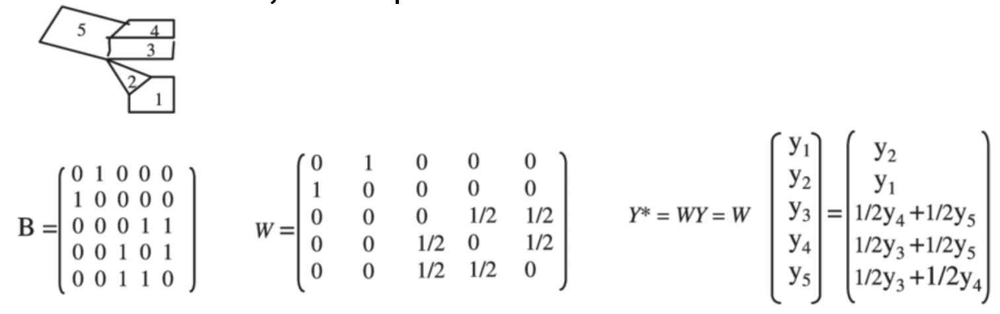

```{r setup, include=FALSE}
knitr::opts_chunk$set(echo = TRUE)
```


## 学习目标

- 描述空间计量经济学的动机  
- 理论与实证动因  
- 进行基本的空间描述与相关性检验（R语言）  
- 可视化与结果解读  
- 选择并应用关键的空间模型（R语言）  
  - 空间误差模型（SEM）、空间自回归模型（SAR）、空间杜宾模型（SDM）  
- 正确解读空间回归结果  
- 实践操作

## 为什么要使用空间计量模型？

- 地理位置和空间结构重要，存在空间相关性  
- 传统计量经济模型假设观测单位独立，忽略空间互动，可能导致估计偏差和不一致  
- 需要建模空间依赖性，以获得有效推断结果

## 理论基础

- **地理学第一定律**（Tobler，1970）：**"一切事物都是相关的，但近的事物比远的更相关。"**  
- **溢出效应**：一个地区的结果受邻近地区影响  
- **战略相互依赖**：个体根据邻居行为反应（如税收竞争）  
- **遗漏变量偏差**：空间相关但不可观察的因素  


## 空间过程与模型匹配

| 动机 | 含义 | 模型 |
|------|------|------|
| i.i.d.假设被破坏 | 空间自相关误差项 | SEM |
| 溢出效应 | 滞后因变量起作用 | SAR |
| 战略互动 | 内生空间依赖 | SAR、SDM |
| 遗漏变量 | 相关误差项 | SEM |
| 政策扩散 | 间接/溢出效应 | SDM |

## 实证动因 - 实际案例

- 城市经济学：房价、急救响应、污染  
- 公共财政：税收模仿、支出溢出  
- 区域发展：基础设施跨区域影响  
- 流行病学：疾病传播模式  
- 忽略空间效应会低估政策影响或误判显著性水平

## 空间滞后

- 空间滞后是时间序列相关性的空间类比，但更为复杂。  
- 主要区别：  
  - 空间滞后是多方向关系，而时间序列相关性是单方向（只能过去影响未来）。  
  - 空间滞后会消耗自由度，而时间序列相关性不会。  
  - 空间滞后使用预定义的空间权重矩阵（W），而时间序列相关性没有。  
  - 空间滞后性可比较不同的W矩阵以获得稳健性结果。

空间异质性？？

## 何时考虑空间回归？

- 每个观测值对应一个空间位置或区域  
- 一定要进行探索性空间数据分析以识别空间相关性

## 空间（自）相关指标  
- **全局莫兰指数（Global Moran's I）**
  - 为整个研究区域提供一个值
  - 取值范围：-1 到 +1
  - 0 表示完全随机
  - -1 表示完全分散（负相关，高-低/低-高）
  - +1 表示完全聚集（正相关，高-高/低-低）
- **示例**：莫兰指数 = 0.3699
- **局部空间自相关（LISA（Local Indicators of Spatial Autocorrelation），Anselin, 1995）**
  - 为每个空间单位提供一个值
  - 所有观测值的LISA总和与全局空间关联指标成比例
  - 聚集类型：高-高 或 低-低
  - 异常值：高-低 或 低-高
  
- **全局与局部统计可扩展到双变量空间相关**
  - **双变量全局莫兰指数**：一个单位中的变量是否与邻近单位的另一个变量在全局范围内空间相关
  - **双变量局部莫兰指数**：一个单位中的变量是否与邻近单位的另一个变量在局部范围内空间聚集
  - 与皮尔逊相关系数不同，不仅考虑数值相关性，还考虑地理接近性
- **示例**：1960年凶杀案与失业率（全局莫兰指数，未显著，2053年）


## 空间权重矩阵（W）

- 描述空间单位间的结构或连通性  
- 常为n×n稀疏矩阵，行标准化（行和为1）



- **连通型矩阵**
  - **Rook邻接**：共享边界的邻居
  - **Queen邻接**：共享边界或角落的邻居
  - 示例：中心单元（E）的邻居
    - Rook：B、D、F、H
    - Queen：A、B、C、D、F、G、H、I  
  

### 距离型矩阵：
- 反距离权重：1/d^2  
- 距离带法：指定范围内为邻居  
- K近邻：最近的K个单位为邻居

### 非地理型矩阵：
  - 社交连接：谁与谁在社交网络中互动
  - 经济相似性：哪些公司属于同一行业或具有相似财务特征
  - 功能关系：组织内哪些部门在项目中合作
  - 共享属性：哪些个体具有相似的年龄、收入或政治观点

## 如何选择 W？

- W矩阵的设定具有一定的主观性  
- 不设W（即设为0）意味着假设空间独立，反而更强  
- 不同W可能导致参数估计差异（尤其在早期文献中）  
- 实证研究会有许多不同的矩阵设定，通过敏感性分析消除疑虑  

## Shapefile 简介

- ESRI开发的地理矢量数据格式  
- 常见文件包括：`.shp`, `.shx`, `.dbf` 等  

---

## 案例数据

- 数据集：NC（spData 或 spdep 包）  
- 范围：北卡罗来纳州100个县  
-  **变量**：
  - BIR74, BIR79：1974年和1979年的出生数
  - SID74, SID79：1974年和1979年的婴儿猝死数
  - NWBIR74, NWBIR79：1974年和1979年非白人母亲的出生数
  - NAME, FIPS, CNTY_ID：县标识符和名称
- **来源与原始出版**：
  - 原始研究：Cressie, Noel. (1993). *Statistics for Spatial Data*. Wiley.
  - 由Luc Anselin等人编译，最初用于空间计量建模
  - 参考文献：Bivand, Roger S., Edzer J. Pebesma, and Virgilio Gómez-Rubio (2008, 2013). *Applied Spatial Data Analysis with R*.

- 读取数据与呈现  

```{r message=FALSE}
library(sf)
library(spdep)
library(ggplot2)
library(leaflet)
library(spatialreg)
library(lmtest)
library(stargazer)
library(gt)
library(dplyr)
# 载入shp文件
nc <- st_read(system.file("shape/nc.shp", package="sf"))
# 将空间数据转换为WGS84经纬度坐标系，便于与其他通用地理数据或工具（如Leaflet、ggplot2等）兼容
nc <- st_transform(nc, crs = 4326)

# 可视化
ggplot(nc) +
  geom_sf(fill = "lightblue", color = "white") +
  theme_minimal() +
  labs(title = "North Carolina Counties")

# 采用leaflet包创建交互式地图
pal <- colorNumeric("YlGnBu", domain = NULL)  # 可根据需要定义变量

leaflet(nc) %>%
  addTiles() %>%
  addPolygons(
    fillColor = ~pal(1),  # 可根据变量选定颜色
    fillOpacity = 0.6,
    color = "black",
    weight = 1,
    popup = ~paste("ID:", row.names(nc))
  )
```

- 出生率示意图

```{r}
# 采用ggplot2绘制静态地图

ggplot(nc) +
  geom_sf(aes(fill = BIR74), color = "white") +
  scale_fill_viridis_c(option = "C", name = "Birth Rate") +
  theme_minimal() +
  labs(title = "Choropleth of Birth Rate 1974 (Static)")

# 采取leaflet绘制交互式地图
pal <- colorNumeric(palette = "YlOrBr", domain = nc$BIR74)

leaflet(nc) %>%
  addTiles() %>%
  addPolygons(
    fillColor = ~pal(BIR74),
    fillOpacity = 0.7,
    color = "black",
    weight = 1,
    popup = ~paste("Birth Rate:", BIR74)
  ) %>%
  addLegend("bottomright", pal = pal, values = ~BIR74,
            title = "Birth Rate")
```

- 空间连通性

```{r}
# 创建连通加权矩阵（queen）
nb_contig <- poly2nb(nc) # 从多边形生成邻居列表
listw_contig <- nb2listw(nb_contig, style = "W") # 添加按行标准化的权重

# 可视化连通性
centroids <- st_centroid(st_geometry(nc))
coords <- st_coordinates(centroids) # 获取地理单元的中心点及其坐标

nb_lines <- nb2lines(nb_contig, coords = coords, as_sf = TRUE)
st_crs(nb_lines) <- st_crs(nc)  # 将邻居列表转化为空间线条数据框，并附加坐标系

# 呈现邻居连通性
ggplot() +
  geom_sf(data = nc, fill = "grey95", color = "black") +
  geom_sf(data = nb_lines, color = "red", size = 0.5, alpha = 0.6) +
  theme_minimal() +
  labs(title = "Spatial Contiguity Links")


```

- 全局莫兰检验和呈现

```{r}
# 莫兰检验和呈现
moran.test(nc$BIR74, listw = listw_contig)

moran.plot(nc$BIR74, listw = listw_contig,
           labels = FALSE, xlab = "Birth Rate",
           ylab = "Spatial Lag of Birth Rate",
           main = "Moran Scatterplot of Birth Rate")

```

- 局部空间相关指数（LISA）的呈现

```{r}
# 利用空间权重矩阵，获取变量的空间滞后项
nc$lag_BIR <- lag.listw(listw_contig, nc$BIR74)

# 基于空间权重，分别计算每个地理单元局部莫兰指数
local_moran <- localmoran(nc$BIR74, listw=listw_contig)

# 添加局部莫兰指数的结果，包括指数统计量、标准差、显著性水平
nc$Ii     <- local_moran[, "Ii"]
nc$Z_Ii   <- local_moran[, "Z.Ii"]
nc$p_Ii   <- local_moran[, "Pr(z != E(Ii))"] 

# 划分LISA集合的类别
# Global means
mean_BIR <- mean(nc$BIR74, na.rm = TRUE)
mean_lag <- mean(nc$lag_BIR, na.rm = TRUE)
nc$cluster <- factor(
  ifelse(nc$BIR74 > mean_BIR & nc$lag_BIR > mean_lag & nc$p_Ii <= 0.05, "High-High",
         ifelse(nc$BIR74 < mean_BIR & nc$lag_BIR < mean_lag & nc$p_Ii <= 0.05, "Low-Low",
                ifelse(nc$BIR74 > mean_BIR & nc$lag_BIR < mean_lag & nc$p_Ii <= 0.05, "High-Low",
                       ifelse(nc$BIR74 < mean_BIR & nc$lag_BIR > mean_lag & nc$p_Ii <= 0.05, "Low-High",
                              "Not Significant")))),
  levels = c("High-High", "Low-Low", "High-Low", "Low-High", "Not Significant")
)

# Optional: Make sure 'cluster' is a factor with proper levels
nc$cluster <- factor(nc$cluster, levels = c("High-High", "Low-Low", "High-Low", "Low-High", "Not significant"))

# Define custom colors for each cluster type
cluster_colors <- c(
  "High-High" = "red",
  "Low-Low" = "blue",
  "High-Low" = "orange",
  "Low-High" = "lightblue",
  "Not significant" = "lightgray"
)

# Plot using ggplot
ggplot(nc) +
  geom_sf(aes(fill = cluster), color = "white", size = 0.2) +
  scale_fill_manual(values = cluster_colors, name = "LISA Cluster") +
  labs(title = "LISA Cluster Map: BIR74") +
  theme_minimal()

```


## 基本模型规格
- **空间误差模型（SEM）**：Y = α + Xβ + μ, μ = ρWμ + ε
- **空间自回归模型（SAR）**：Y = α + ρWY + Xβ + ε
- **空间杜宾模型（SDM）**：Y = α + ρWY + Xβ + WXβ + ε
- **模型嵌套关系**：
  - SDM嵌套SAR和SEM模型
  - 使用测试程序指导简化
  - SDM是最通用的（灵活的）模型

## OLS残差的空间依赖性测试
- **零假设**：无空间依赖性
- **两种变体**：
  - LM-lag：测试SAR模型
  - LM-error：测试SEM模型
- 当两者均显著时，使用稳健LM测试

## 似然比检验（Likelihood Ratio Test）
- （内容被截断，可能包含大量重复的“2”）

## 空间参数估计（ρ 和 λ）
- 示例：p = 1, p = 0.5, p = 0.1

## SDM和SAR中的直接与间接效应
- 空间滞后在右侧时，估计系数β不能直接解释为“影响”
- （SAR模型公式被截断）

## 空间矩阵
- 矩阵是对角矩阵 (I - ρW)^(-1)

## 建议
- 始终测试空间依赖性
- 如有疑问，优先选择SDM模型，然后测试简化为SAR或SEM
- 当模型不明确时，使用稳健LM测试
- 谨慎解释SDM效应

## 空间面板
- **双向固定效应**：时间与空间
- **多种空间模型规格**：
  - 参考文献：Cheng and Guo (2021); Han, Xiong, Cheng, and Guo (2022); Guo and Cheng (2018)
- **动态空间面板**：
  - 因变量不仅在时间上相关，还在空间上相关
  - 参考文献：Cheng, Guo, and Liu (2020)
- **空间Probit模型**：
  - 二元或多项因变量
- **空间多层次/层级模型**：
  - 嵌套结构（如城市嵌入省份）
- **社交网络分析中的空间模型**


## 基本空间模型

- **OLS**：Y = α + Xβ + ε  
- **SEM**：Y = α + Xβ + μ，μ = ρWμ + ε  
- **SAR**：Y = α + ρWY + Xβ + ε  
- **SDM**：Y = α + ρWY + Xβ + WXθ + ε  

 SDM 是最通用的模型，嵌套 SAR 与 SEM  

---

## 模型选择流程

### 从具体到一般：
1. 拟合OLS
2. 对残差进行LM检验
   - LM-lag 检测SAR
   - LM-error 检测SEM
   - 若均显著，用R-LM检验  
3. 若确认存在空间依赖，拟合 SDM  
4. 使用 LR 检验比较 SDM 与 SAR/SEM

---

## SDM 与 SAR 中的效应

- SAR 中 β 不能直接解释为边际效应  
- 空间反馈机制需通过逆矩阵表示  
- LeSage & Pace（2014）：即使W不同，最终的效应矩阵（I - ρW）⁻¹ 乘以 β 很稳定  

### 效应类型：
- **直接效应**：对自身的平均影响（主对角线均值）  
- **总效应**：每行和的平均值  
- **间接效应**：总效应 - 直接效应  

---

## 实用建议

- 一定要检测空间依赖性  
- 若不确定，先用 SDM，再通过检验简化  
- 解释 SDM 效应时要小心  

---

## 拓展方向

- 空间面板模型（双向固定效应）  
- 动态空间面板  
- 空间 Probit（二值/多项）模型  
- 多层/层级空间模型  
- 社会网络中的空间分析  

---

## 推荐文献

- Anselin (1988). *Spatial Econometrics: Methods and Models*  
- LeSage & Pace (2009). *Introduction to Spatial Econometrics*  
- LeSage & Pace (2014). https://doi.org/10.3390/econometrics2040217  
- Bivand et al. (2013). *Applied Spatial Data Analysis with R*  
- Cheng & Guo (2021). https://doi.org/10.1080/03003930.2020.1794845  
- Guo & Cheng (2017). https://doi.org/10.52324/001c.8009  


## 有问题或评论？

**感谢您的参与！**


郭海老师提到的用到spatial analysis的论文。供大家参考。https://onlinelibrary.wiley.com/doi/abs/10.1111/pbaf.12160
https://www.tandfonline.com/doi/abs/10.1080/23276665.2022.2071305
